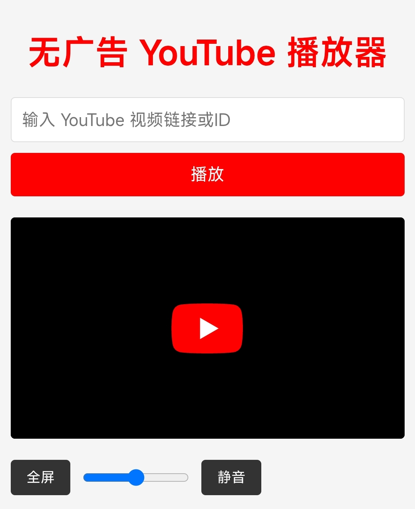
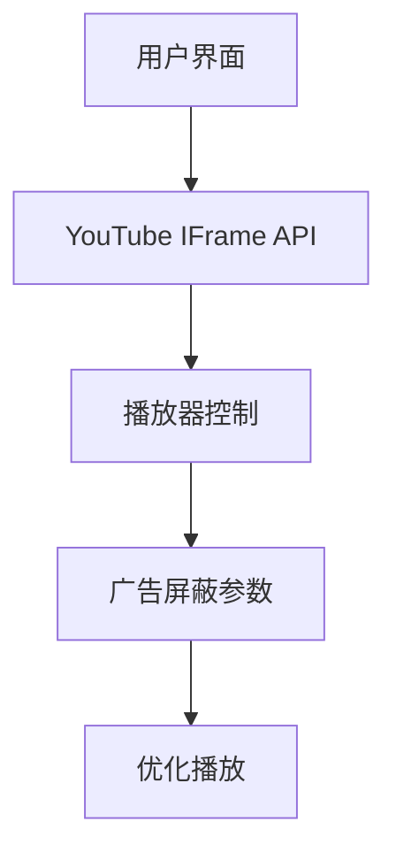

# 🎥 PureTube - 优雅的无广告 YouTube 播放器  

  

## ✨ 特性亮点  

- 🌈 **极简美学设计** - 精心调校的 UI 与动画效果  
- 🚫 **广告拦截** - 通过智能参数屏蔽大部分广告  
- 🎛️ **专业控制台** - 音量、画质、播放速度一键调节  
- 🌍 **多平台适配** - 从手机到 4K 显示器完美呈现  
- ⚡ **闪电加载** - 优化过的代码确保流畅体验  

## 🚀 一键部署

### Cloudflare Pages 部署

[](https://dash.cloudflare.com/?to=/:account/pages/new/upload?url=https://github.com/yourusername/puretube)

**部署步骤**:
1. 点击上方按钮
2. 登录您的Cloudflare账户
3. 选择"连接到Git"并授权
4. 选择您的仓库分支(main/master)
5. 在构建设置中保持默认配置
6. 点击"保存并部署"

部署完成后，您将获得一个类似 `https://your-project.pages.dev` 的专属域名

### 其他部署方式

| 平台 | 部署按钮 | 备注 |
|------|----------|------|
| Vercel | [](https://vercel.com/new/clone?repository-url=https://github.com/yourusername/puretube) | 适合边缘网络 |
| Netlify | [](https://app.netlify.com/start/deploy?repository=https://github.com/yourusername/puretube) | 带CI/CD |
| Render | [](https://render.com/deploy) | 免费托管 |

## 🛠️ 本地开发

```bash
# 克隆仓库
git clone https://github.com/yourusername/puretube.git
cd puretube

# 启动本地服务器(需要Python)
python3 -m http.server 8000

# 或者在Node.js环境下
npx serve
```

访问 `http://localhost:8000` 查看效果

## 🎮 使用说明  

1. **粘贴链接** - 输入 YouTube URL 或视频 ID  
   ```
   支持格式:
   - https://youtu.be/dQw4w9WgXcQ
   - https://www.youtube.com/watch?v=dQw4w9WgXcQ
   - 直接输入 dQw4w9WgXcQ
   ```

2. **高级控制**  
   - `空格键` 播放/暂停  
   - `F` 进入全屏  
   - `↑↓箭头` 调节音量  
   - `←→箭头` 前进/后退 5秒  

3. **画质选择**  
   右键点击播放器可选择分辨率  

## 🌈 主题定制  

在 `styles.css` 中修改 CSS 变量即可换肤：  
```css
:root {
  --primary-color: #ff4d4d;  /* 主色调 */
  --bg-color: #121212;       /* 背景色 */
  --text-color: #e0e0e0;    /* 文字色 */
  --control-bg: rgba(30,30,30,0.7); /* 控制栏背景 */
}
```

## 📊 技术架构  



## 🚧 已知限制  

⚠️ 因 YouTube 政策限制：  
- 部分版权视频可能无法播放  
- 移动端全屏需要手势操作  
- 4K 画质需要高级账号  

## 🤝 参与贡献  

我们欢迎各种形式的贡献！  
1. 提交 Issue 报告问题  
2. Fork 项目并提交 PR  
3. 帮助改进文档  
4. 分享使用体验  

## 📜 开源协议  

MIT License | © 2023 PureTube Contributors  

---

<div align="center">
  <sub>用 ❤️ 制作 | 星星支持我们 ⭐</sub>
</div>

---
